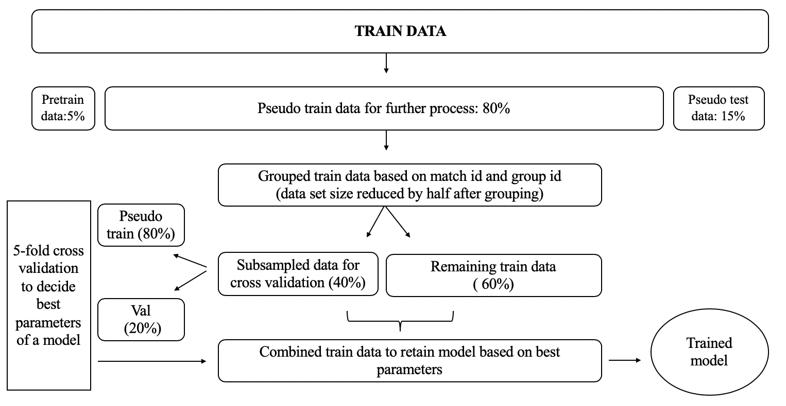
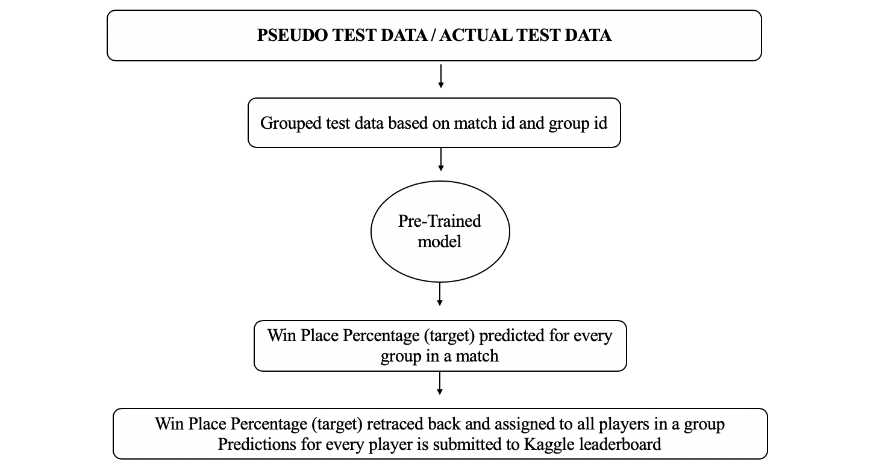
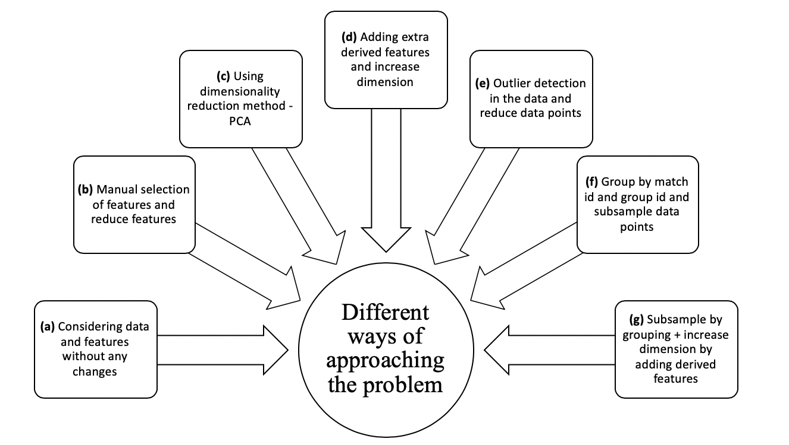

# Kaggle Competition - PUBG Finish Placement Prediction

- This project is taken up from Kaggle, an online community of data scientists and machine learners ([link to competition](https://www.kaggle.com/c/pubg-finish-placement-prediction))
- The goal of the project is to predict PUBG player’s win place percentage based on the player’s statistics.
- Millions of players data is used for building a regression model.
- Players data within a group in a match is combined to reduce the dataset size.
- Some insightful derived features are added to improve the predictions.
- The best model using Light Gradient Method achieved a Kaggle leaderboard score of 0.0214 on test data.
- For more information about data analysis and various experiment results, kindly look into [doc.pdf](https://github.com/mcabinaya/Kaggle-PUBG-Finish-Placement-Prediction/blob/master/doc.pdf) file. 
- Final code for prediction is given in main.py file.

## Model training

## Model testing

## Different approaches

